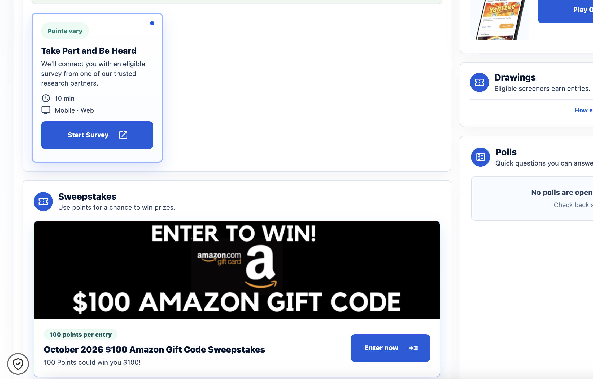
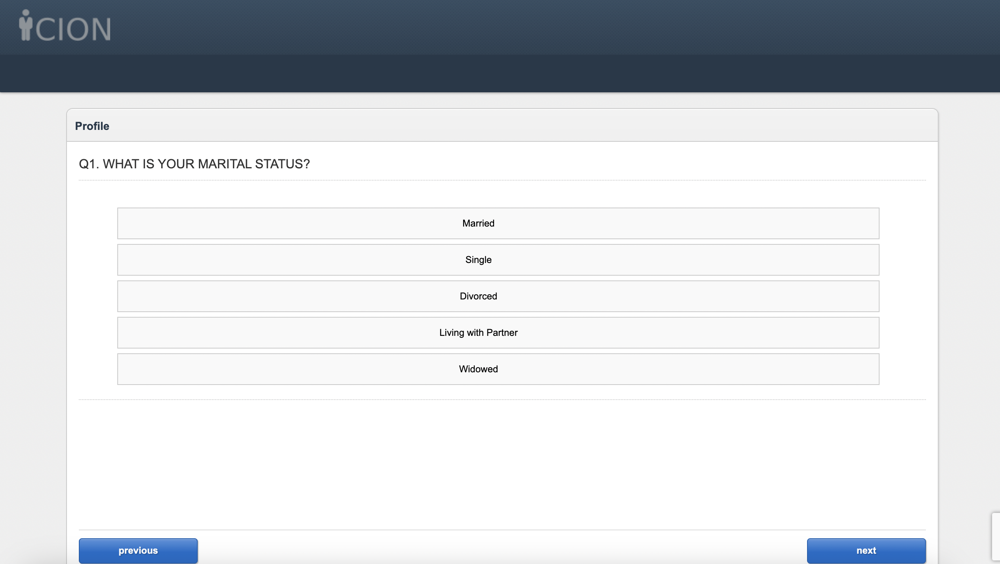

## Introduction

For this assignment, I enrolled in the American Consumer Opinion consumer
panel and participated in an online research survey. The purpose of the
experience was to observe a survey
from the participant's perspective and evaluate the quality of its questions,
response options, and overall design. This perspective is useful because a
questionnaire can seem clear to its designer but confusing or frustrating to a
participant.

The panel dashboard indicated that the survey would take approximately ten
minutes and would connect me with an eligible study from a research partner.

{fig-alt="Consumer panel dashboard showing an available survey"}

I selected the profile question below because its response options did not
fully cover all possible situations and because marital status is personal
information. I considered whether the question would produce complete and
accurate data for every participant.

## Question 1: Marital Status

{fig-alt="Screenshot of the first survey question"}

### Why I selected this question

I selected this question because the answer choices did not cover every
possible relationship or marital status. The list included “Married,”
“Single,” “Divorced,” “Living with Partner,” and “Widowed,” but it did not
include “Separated,” “Other,” or “Prefer not to answer.” Some respondents may
not identify with any of the available choices, and others may not feel
comfortable answering this personal question.

### How the question could be improved

The researcher could improve the question by adding “Separated,” “Other,” and
“Prefer not to answer.” The options should also be reviewed to make sure that
“Married” and “Living with Partner” are clearly defined and do not overlap for
participants. These changes would make the question more inclusive and reduce
forced or inaccurate answers.

## Lessons Learned for Our Research Project

This experience taught me that survey design must be evaluated from the
participant's point of view, not only from the researcher's point of view. The
main lessons I can apply to our research project are:

1. **Use clear and specific wording.** Participants should not have to guess
   what a question means or which time period they should consider.
2. **Ask one thing at a time.** Double-barreled questions make it impossible
   to know which part of the question influenced the response.
3. **Avoid leading or biased wording.** Questions should not suggest that one
   answer is more desirable than another.
4. **Make response options complete and balanced.** The choices should cover
   the most likely answers and include “Other,” “Not sure,” or “Not applicable”
   when needed.
5. **Use an appropriate scale.** A scale should have a logical order and
   clearly labeled endpoints. The number of choices should be manageable.
6. **Test the questionnaire before launching it.** A pilot test can reveal
   confusing wording, missing answer choices, technical issues, and questions
   that participants interpret differently than intended.
7. **Respect the participant's experience.** A survey that is easy to follow
   is more likely to produce thoughtful, complete, and reliable responses.

## Conclusion

Participating in a consumer panel helped me understand that questionnaire
quality affects both the participant experience and the quality of the final
research data. The questions I reported were important examples because they
showed how ambiguity, incomplete response options, or multiple ideas in one
question can reduce the usefulness of the responses. I will use these lessons
when developing and reviewing questions for our research project.
